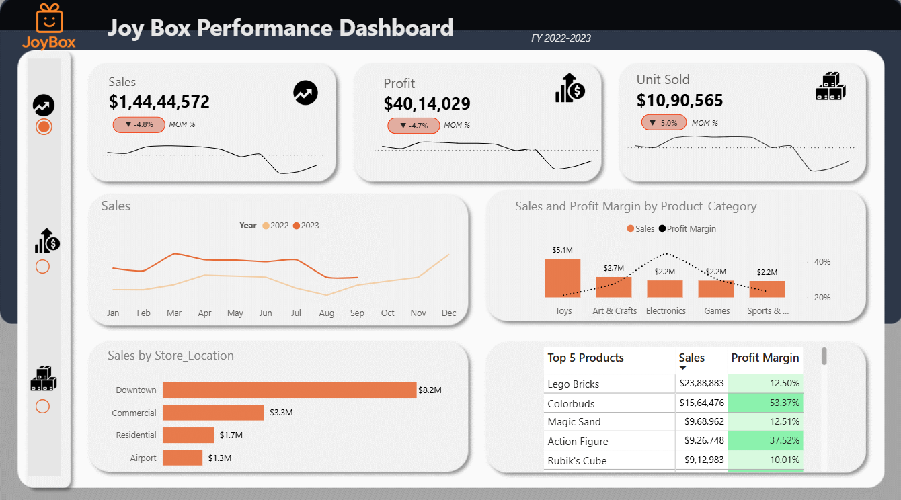

# **BrewVista Coffee Sales Analysis :**

## Table of Contents  

- [Project Background](#project-background)  
- [Executive Summary](#executive-summary)  
- [Insights Deep-Dive](#insights-deep-dive)  
  - [Sales Trends and Growth Rates](#sales-trends-and-growth-rates)  
  - [Peak Hours & Daily Sales Patterns](#peak-hours--daily-sales-patterns)  
  - [Top 10 Most Selling Products](#top-10-most-selling-products)  
  - [Product Categories by Revenue](#product-categories-by-revenue)  
- [Recommendations](#recommendations)  

---

  

---

##  Project Background 
BrewVista is a fictitious coffee shop chain operating across three locations in New York City — Astoria, Hell’s Kitchen, and Lower Manhattan. As a Data Consultant, I was tasked with extracting meaningful insights from sale's data and providing actionable recommendations to improve performance across sales , product and marketing teams.

---

## Executive Summary
BrewVista earned **$698K** revenue (Jan–Jun 2023) with balanced sales across all stores. Sales **grew strongly** after February and peaked in June, though the pace has slowed. Beverages dominate with Coffee and Tea driving **66%** of revenue, while categories like Loose Tea and Packaged Chocolate remain weak. Astoria shows **steady demand** even with shorter hours, while evening traffic at Hell’s Kitchen and Lower Manhattan **drops sharply**.
To build on these trends, BrewVista could run fresh promotions to sustain growth, rebrand or bundle underperforming categories, extend hours at Astoria, and close earlier at low-traffic stores to save costs.

---

## Insights Deep-Dive

### Sales Trends And Growth Rates
- Total revenue reached $698K with overall upward trend. After a -6.7% dip in feburary, sales rebounded with 30% Growth in march with peaking in June at $166K.
- March-May accounts for  53% of revenue, hinting at seasonality with high beverages demand in spring. 
- Although sales continue to grow , the pace has slowed by june, suggesting demand stabilization.
- Sales are evenly spread across all three NYC locations, indicating balance performance without reliance on single store.  

  

### Peak Hours & Daily Sales Patterns
- Sales surge during the morning rush (7–11 AM), contributing 46.2% of total sales, showing how critical these hours are for daily performance.
- Lower Manhattan and Hell's kitchen dominates morning rush with 54% of their daily sales between 7–11 AM, compared to 43% in Astoria.
- Between 2–5 PM, sales drop by 43% on average, suggesting untapped potential for snacks or promotional offers.
- Hell’s Kitchen and Lower Manhattan loses momentum sharply after 8 PM (-78%) and 7 PM (-91%) , whereas Astoria maintains steadier late-hour traffic despite shorter operating hours.

  

### Top 10 Most Selling Products

- The top 10 products contribute 80% of total sales volume, showing that customer demand is concentrated in a narrow set of items.
- Brewed Chai Tea leads with the highest units sold (17K orders), while Barista Espresso dominates in revenue, contributing 13% of total sales.
- Hot Chocolate matches the order volume of Brewed Black Tea and Brewed Herbal Tea, yet delivers a 3.5% higher revenue share, highlighting its higher value per order.
- Regular and Sugar Syrup drive 4.7% of sales but only 1% of revenue, showing high demand but weak financial impact.

  

### Product Categories by Revenue

- Coffee and Tea account for 66.7% of total revenue, highlighting both a strength (consistent demand) and a dependency risk if consumer preferences shift.
- Together with Bakery and Drinking Chocolate, the top four categories account for ~89% of revenue, meaning almost all sales are concentrated in a handful of categories.
- Bakery (11.8%) and Drinking Chocolate (10.4%) play a strong supporting role, together adding over 20% of revenue, suggesting they’re key complements to Coffee/Tea purchases.
- Coffee Beans (5.7%) generate a noticeable share with highest AOV $22.8 but lag behind ready-to-drink coffee/tea, reinforcing the idea that customers prefer immediate consumption over take-home products.
- Branded, Loose Tea, Flavours, and Packaged Chocolate combined contribute less than 5.5% of revenue, highlighting very low consumer interest.

  

---

## Recommendations

- Introducing a summer campaign or seasonal specials can help boost sales  during low growth month.
- Since drinks dominate, speed and quality of beverage preparation during rush hours directly impact revenue and customer satisfaction,  as well as regular inventory supervision to keep revenue flow.
- Extend Astoria’s hours to capture additional revenue, while considering earlier closing at Hell’s Kitchen and Lower Manhattan to optimize resources.
- Coffee Beans, Branded products, Loose Tea has High AOV suggesting bundling, discounts, or marketing campaigns to increase sales.
- Create loyalty programs for customers buying high-AOV products to sustain and promote growth for targeted segment.
- Flavours has very low AOV , it could be bundled with other products to increase order value.

---

- Raw Excel file - [here](BrewVista_Sales.xlsx)
- My Analysis and Pivot Tables - [here](BrewVista_Sales_raw.xlsx)
- Visualizations - [here](visualization)
