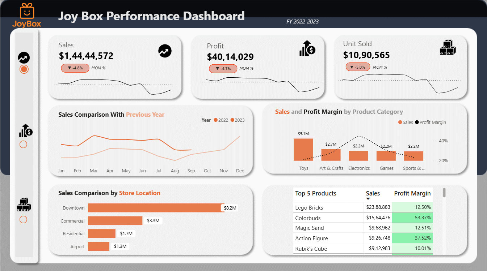
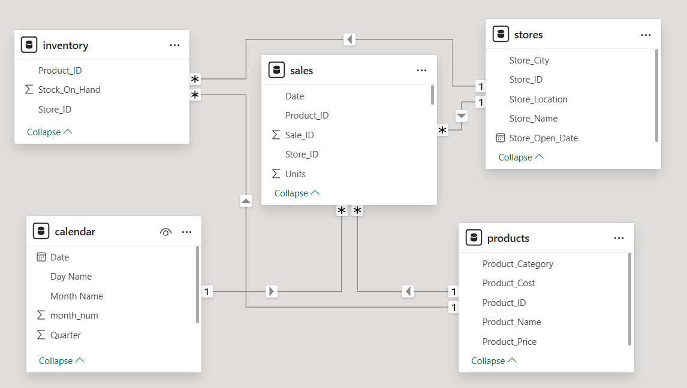
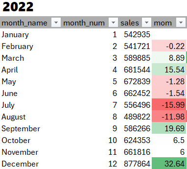
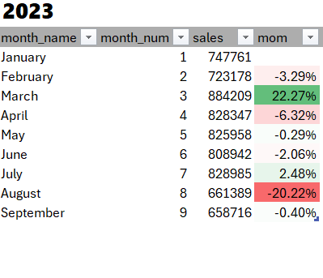
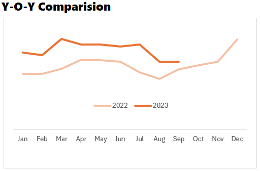
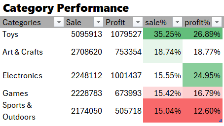
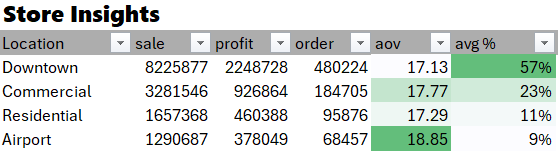

# Business Performance Analysis of Joybox Toy Store

## Table of Contents

- [Project Background](#project-background)
- [Executive Summary](#executive-summary)
- [Insights Deep-Dive](#insights-deep-dive)
    - [Sales Performance and Growth Rates](#sales-performance-and-growth-rates)
    - [Product and Category Performance](#product-and-category-performance)
    - [Store Insights](#store-insights)
- [Recommendations](#recommendations)

---

---

## Project Background

This project analyzes sales and inventory data from a fictitious toy store chain in Mexico called **JoyBox Toy Store**. The dataset comprises **829K rows** detailing product information, store locations, daily sales transactions, and inventory levels across all branches. The analysis focuses on identifying key sales trends, stock availability issues, and overall business performance over time.

---

## Executive Summary

JoyBox Toy Store generated **$14M in sales** and **over $4M in profit** between January 2022 and September 2023. Monthly sales showed high seasonality, growing **16% in March** but dropping **-16% in August** (likely due to exam season) before strongly rebounding by **32% in December** during the holidays.

**Art & Crafts** and **Toys** dominated sales, contributing 54% of total revenue, while **Electronics** achieved the highest profit margin (44%). The **Downtown** store led overall performance with $8M in sales and $2M profit. In contrast, the **Airport** store, despite contributing only 9% of total sales, recorded the highest **Average Order Value (AOV) at $18.85**.

**LEGO Bricks** stood out as the best-selling product, generating $2M in sales with an AOV of $49.75, but frequently suffered from critically low stock levels.

To boost profitability and stabilize sales, it is recommended to **increase stock levels** of top-selling, high-AOV items like LEGO Bricks and Electronics by 15–20% and introduce **promotional offers** during off-peak months (July–August) to counter seasonal sales dips.

  

---

## Insights Deep-Dive

### Sales Performance and Growth Rates

- JoyBox achieved **$14M in total sales** and **$4M in profit** from 1M units sold between January 2022 and September 2023. Sales peaked in December 2022 at **$877K**.
- Sales grew **16% in March** due to seasonal promotions, then began to decline, reaching a low of **-16% in August**, likely coinciding with the exam season.
- The holiday surge in December showcased the highest growth, with a **32% month-over-month increase**.
- **Overall, 2023 outperformed 2022** in both sales and profit, indicating positive year-over-year growth momentum.

<table style="width:100%;">
  <tr>
    <td style="width:50%; text-align:center;">
      
    </td>
    <td style="width:50%; text-align:center;">
      
    </td>
     <td style="width:50%; text-align:center;">
      
    </td>
  </tr>
</table>

### Product and Category Performance

- **Art & Crafts** and **Toys** together accounted for **54% of total sales**, establishing them as the store’s core revenue categories.
- **Electronics** achieved the highest profit margin at **44%**, reflecting superior pricing power or cost efficiency.
- **Books** and **Games** maintained stable but lower contributions, suggesting opportunities for cross-promotional or bundle strategies.
- **LEGO Bricks** emerged as the top-selling product with **$2M in sales** and an AOV of **$49.75**, yet is frequently out of stock, indicating a critical supply gap.
- **Deck of Cards** ranked among the top six contributors to sales despite its lower AOV, highlighting strong repeat purchases or high volume.

  

### Store Insights

- The **Downtown** store dominated performance with **$8M in sales** and **$2M in profit**, contributing **57% of overall revenue**.
- The **Airport** store contributed only **9%** of total sales but achieved the highest **AOV of $18.85**, suggesting a customer base that makes fewer, higher-value purchases.
- High sales concentration in Downtown points to dense customer traffic, while the Airport's premium AOV indicates occasional, high-value transactions.
- **Commercial** and **Residential** stores contributed **23% and 11%** of sales, respectively, showing consistent mid-tier performance across months.

  

---

## Recommendations

- **Stabilize Seasonal Dips:** Sales dipped significantly (-16%) during July–August (exam period) but rebounded (+32%) in December. **Implement targeted promotions** or bundled offers during low-demand months and **increase marketing spend** in November–December to maximize holiday revenue.

- **Boost Profit Margins with Electronics:** While Art & Crafts and Toys account for 54% of sales, **Electronics** showed the highest profit margin (44%). **Expand this category** by introducing 3–4 new electronic toy lines or cross-selling electronic add-ons to elevate overall profitability.

- **Capitalize on Premium Traffic:** The Downtown store contributes 57% of sales, but the Airport store, despite lower volume (9%), recorded the highest **Average Order Value ($18.85)**. This suggests a premium customer base. **Introduce exclusive, high-margin, travel-friendly toys** or limited-edition gift bundles at Airport stores to boost profit conversion.

- **Address Stockouts:** Top-selling, high-AOV products like **LEGO Bricks** are frequently out of stock. A critical step is to **increase inventory levels** for these top performers by 15–20% to prevent lost sales and maximize revenue capture.

---

- Raw DataSet - [here](dataset)
- My Analysis  - [here](analysis)
- Visualizations - [here](visualization)
